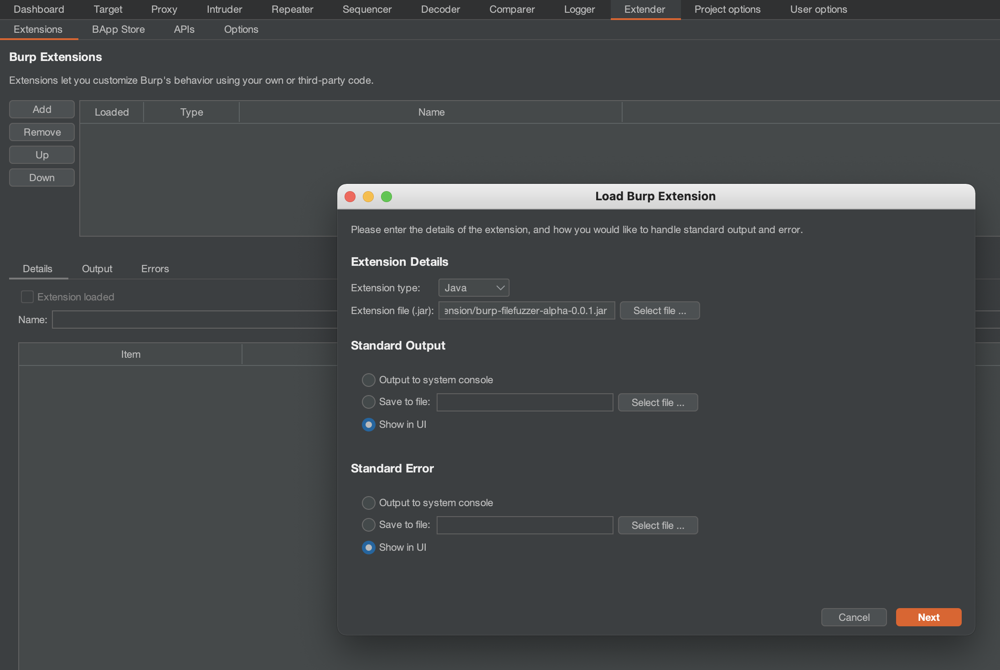
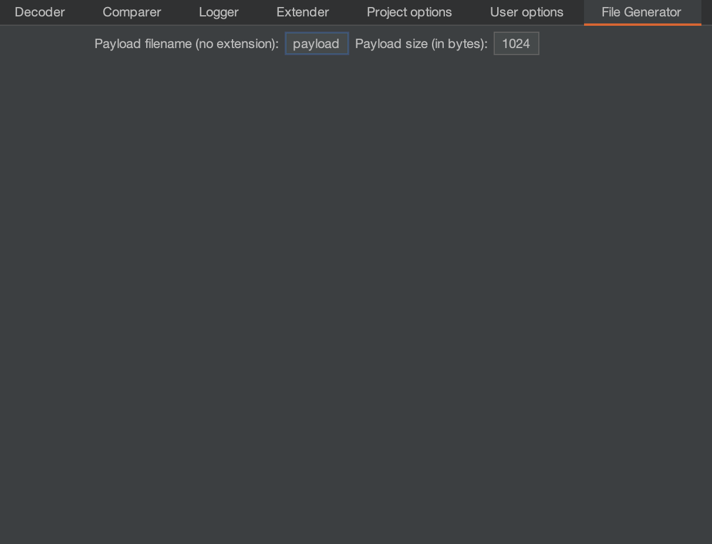

# Burp File Fuzzer
This extension generates synthetic files of different types by appending random bytes to file headers.
It is based on my CLI fuzzer, [httpfuzz](https://github.com/joncooperworks/httpfuzz).
Burp File Fuzzer should be used with Burp Intruder to quickly determine what file types can be uploaded.

## Installation
Installation is simple: download the 
[jar](https://github.com/JonCooperWorks/burp-filefuzzer/releases/download/v0.0.1-alpha/burp-filefuzzer-v0.0.1-alpha.jar)
and install it into Burp using the Extender tab.

## Usage
Burp File Fuzzer will generate files of different types.
It provides three payload generators: one that generates files, one that generates MIME types and one that generates 
filenames.

It should be used in Pitchfork mode with injection points placed on the file and filename.
This will cause Burp File Fuzzer to generate synthetic files and appropriate filenames and mime types.

Set the payload set according to the position of your filename and file contents.
The filename will usually be first in multipart requests.

Payloads for filenames, MIME types and synthetic files should be extension generated by Filename Generator, 
File MIME Type Generator and File Generator
respectively.

For best results, disable URL encoding for filenames and MIME types to prevent the "." in filenames and "/" in MIME 
types from being URL encoded.

File Generator will add a tab to Burp's UI that allows you to set the payload size and base filename.

## Warning
Only use this extension on targets that you have full permission to test.
I am not responsible for anything stupid, immoral or illegal you do with this.